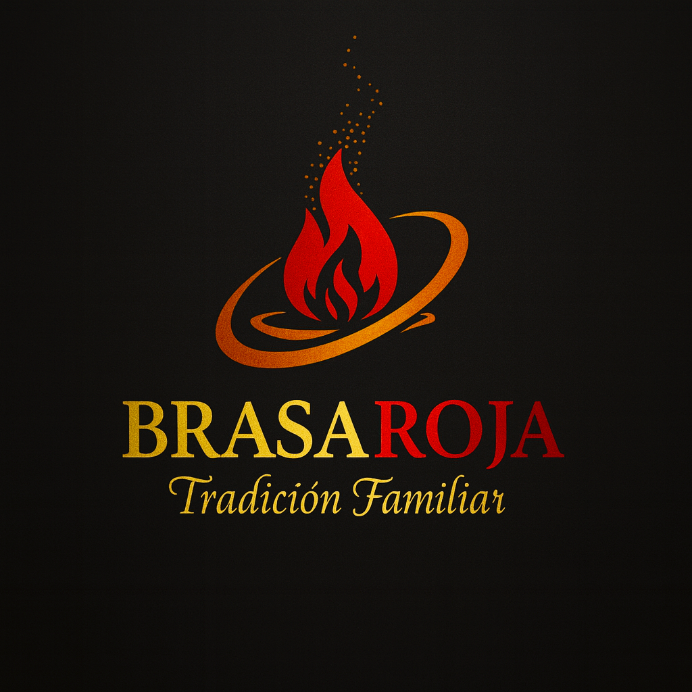

# Brasa Roja
## Tradición Familiar | Parrilla Argentina

---

**Sitio Web:** [brasaroja.lovable.app](https://brasaroja.lovable.app)

---

## Descripción

Brasa Roja es un restaurante familiar de parrilla argentina. El nombre significa "Brasa Roja" en español, representando el corazón ardiente de nuestros fuegos de cocina que han unido a las familias durante generaciones.

---

## Estructura del Proyecto

```
brasa-roja/
├── README.md                              # Este archivo
├── PLAN_Brasa_Roja_Agent_Skills.md       # Plan estratégico del agente y skills
│
├── Brand Guidelines (Documentación)
│   ├── BRASA_ROJA_Brand_Guidelines.md     # Guía de marca (Markdown)
│   ├── BrasaRoja_Brand_Guidelines.pdf     # Guía de marca (PDF)
│   ├── BrasaRoja_Brand_Guidelines.html    # Guía de marca (HTML)
│   └── MASTER_INDEX.html                  # Índice maestro de assets
│
├── Brand_Assets/                          # ✨ LOGOS ORGANIZADOS
│   ├── Logo_Principal/
│   │   ├── Logo_Fondo_Oscuro.png          # Logo principal (fondo oscuro)
│   │   └── Logo_Fondo_Oscuro_Alt.png      # Variante alternativa
│   ├── Logo_Transparente/
│   │   └── Logo_Transparente_Master.png   # ⭐ LOGO CON TRANSPARENCIA REAL
│   ├── Icono/
│   │   ├── Icono_Fondo_Oscuro.png         # Icono de llama
│   │   └── Icono_Variante.png             # Variante del icono
│   ├── Variantes/
│   │   ├── Guia_Variantes_Logo.png        # Referencia de todas las variantes
│   │   ├── Logo_Fondo_Crema.png           # Para fondos claros
│   │   ├── Logo_Monocromo_Dorado.png      # Versión elegante
│   │   └── Wordmark_Solo_Texto.png        # Solo texto
│   └── Referencias/
│       └── Moodboard_Conceptos.png        # Conceptos y moodboard
│
├── Brand_Package/                         # Materiales de marketing
│   ├── 01_Business_Cards.html
│   ├── 02_Email_Signature.html
│   ├── 03_Social_Media_Guidelines.html
│   ├── 04_Menu_Template_Print.html
│   ├── 05_TV_Digital_Menu_Board.html
│   └── 06_Instagram_Templates.html
│
├── skills/                                # 🤖 SKILLS DEL AGENTE
│   ├── brasa-reservas/                    # Sistema de reservas
│   ├── brasa-menu/                        # Gestión de menú
│   ├── brasa-atencion/                    # Atención al cliente
│   ├── brasa-marketing/                   # Marketing digital
│   ├── brasa-inventario/                  # Control de stock
│   └── brasa-finanzas/                    # Facturación y finanzas
│
├── agents/
│   └── brasa-roja-agent.md               # Configuración del agente
│
├── .openclaw/
│   └── settings.json                      # Configuración del sistema
│
├── Deliverables/
│   └── Website_Setup_Checklist.html       # Guía de implementación web
│
└── [Archivos de logo originales]          # Logos en raíz (legacy)
```

---

## Skills del Agente Brasa Roja

| Skill | Descripción | Estado |
|-------|-------------|--------|
| `brasa-reservas` | Gestión de reservas de mesas | ✅ Listo |
| `brasa-menu` | Carta, precios, recomendaciones | ✅ Listo |
| `brasa-atencion` | Atención al cliente, FAQs | ✅ Listo |
| `brasa-marketing` | Redes sociales, promociones | ✅ Listo |
| `brasa-inventario` | Control de stock e insumos | ✅ Listo |
| `brasa-finanzas` | Facturación AFIP, reportes | ✅ Listo |

---

## Logos Principales

### Logo Primario (Fondo Oscuro)


### Logo Transparente (Para Diseño)


### Icono (Llama)


> **Nota:** El archivo `Logo_Transparente_Master.png` es el único con transparencia real verificada. Usarlo para diseño gráfico e impresión.

---

## Colores de Marca

| Color | Hex | RGB | Uso |
|-------|-----|-----|-----|
| **Brasa Gold** | `#C9882B` | 201, 136, 43 | "BRASA", acentos |
| **Roja Red** | `#C63333` | 198, 51, 51 | Llama, "ROJA" |
| **Deep Ember** | `#8B2500` | 139, 37, 0 | Profundidad |
| **Charcoal** | `#2D2D2D` | 45, 45, 45 | Fondos oscuros |
| **Crema** | `#F5EFE0` | 245, 239, 224 | Fondos claros |

---

## Tipografía

| Uso | Fuente | Estilo |
|-----|--------|--------|
| Titulares | Cinzel | Bold, mayúsculas |
| Cuerpo | Lora | Regular |
| Tagline | Parisienne | Script, cursiva |

---

## Valores de Marca

- **Tradición** - Recetas auténticas de generación en generación
- **Familia** - Cada cliente es parte de nuestra familia
- **Fuego** - La pasión del asado a las brasas
- **Calidad** - Solo los mejores ingredientes

---

## Información del Restaurante

### Horarios
| Día | Almuerzo | Cena |
|-----|----------|------|
| Lunes | CERRADO | CERRADO |
| Martes - Sábado | 12:00 - 15:30 | 20:00 - 00:00 |
| Domingo | 12:00 - 16:00 | 20:00 - 23:00 |

### Especialidades
- Asado de tira
- Vacío
- Bife de chorizo
- Entraña
- Empanadas caseras
- Provoleta

---

## Documentación

- **Plan Estratégico:** `PLAN_Brasa_Roja_Agent_Skills.md`
- **Guía de Marca:** `BRASA_ROJA_Brand_Guidelines.md`
- **Assets de Marca:** `Brand_Assets/README.md`
- **Configuración del Agente:** `agents/brasa-roja-agent.md`

---

## Licencia

Todos los assets de marca son propiedad de **Brasa Roja**.
Contactar para permisos de uso.

---

*Brasa Roja - Tradición Familiar*
*Enero 2026*
